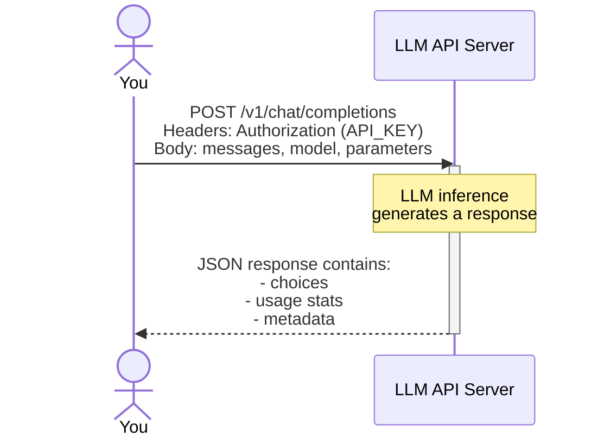

# Harnessing LLMs for research
Foundations of Research Computing (FORC) Camp

_Sajid Ali_, _NYU Research Technology Services_ <a href="https://services.rt.nyu.edu/" class="ns-c-iconlink"><mdi-open-in-new /></a>  

<div class="abs-br m-6 text-xl">
  <a href="https://github.com/NYU-RTS/llm-forc" target="_blank" class="slidev-icon-btn">
    <carbon:logo-github />
  </a>
</div>

<!--
The last comment block of each slide will be treated as slide notes. It will be visible and editable in Presenter Mode along with the slide. [Read more in the docs](https://sli.dev/guide/syntax.html#notes)
-->

---
hideInToc: true
---
  
# Table of contents

<Toc text-sm minDepth="1" maxDepth="1" />

---
layout: side-title
side: l
color: violet
titlewidth: is-4
align: rm-lm
---

:: title ::

# What are LLMs?

# <mdi-arrow-right />

:: content ::

Let's go over some basics of what LLMs are and how they generate text.

---
layout: top-title-two-cols
columns: is-5-7
align: l-lt-lt
color: violet-light
hideInToc: true
---


[^ref1]: <div class="ns-c-cite">Adapted from Hands-On Large Language Models by Jay Alammar & Maarten Grootendorst.</div>

:: title ::

# Neural Networks

:: left ::

- Neural networks are the building blocks of the components that make up an LLM.

- Connected layers of varying shapes

- Inputs "pass" through the network to generate output


:: right ::


Overview of neural networks[^ref1] 


---
layout: top-title-two-cols
columns: is-7-5
align: l-lt-lt
color: violet-light
hideInToc: true
---

[^ref1]: <div class="ns-c-cite"><a href="https://arxiv.org/abs/1706.03762">Attention Is All You Need</a></div>
[^ref2]: <div class="ns-c-cite">Adapted from Hands-On Large Language Models by Jay Alammar & Maarten Grootendorst.</div>


:: title ::

# LLMs overview

:: left ::

- Within natural language, the meaning of a word depends on the context it occurs in, but older language models did not account for this. 

- Recent advances in model architectures[^ref1] to account for it allowed language models to become better at a wider variety of tasks.

- LLMs are neural networks which have billions of parameters!


:: right ::


Applications of LLMs[^ref2]


---
layout: top-title-two-cols
columns: is-6
align: l-lt-lt
color: violet-light
hideInToc: true
---


[^ref1]: [<div class="ns-c-cite">Tiktokenizer</div>](https://tiktokenizer.vercel.app/?model=gpt-4o)


:: title ::

# From text to tokens

:: left ::

- Tokens are the basic unit of operation for LLMs, these are typically units of language 
smaller than words.

- Each token is internally represented by a token embedding

- Special tokens are used to denote things like start/end of sequence, denote the "role" for a sequence, etc.

:: right ::


Interactive demo of tokenization, head to [this link](https://tiktokenizer.vercel.app/?model=gpt-4o) and try it out![^ref1] 


---
layout: top-title-two-cols
columns: is-8
align: l-lt-lt
color: violet-light
hideInToc: true
---


[^ref1]: <div class="ns-c-cite">Adapted from Hands-On Large Language Models by Jay Alammar & Maarten Grootendorst.</div>

:: title ::

# How do LLMs generate output?

:: left ::

- Input tokens are then passed through the LLM to generate an output token. 
- This output token is appended to the input to generate another token.
- So forth until either a special `eos` (end of sequence) token is generated or the number of tokens exceeds the maximum number of tokens that the LLM was allowed to generate.


:: right ::


LLMs generate output one token at a time[^ref1] 


---
layout: top-title-two-cols
columns: is-5
align: l-lt-lt
color: violet-light
hideInToc: true
---


[^ref1]: <div class="ns-c-cite">Adapted from Hands-On Large Language Models by Jay Alammar & Maarten Grootendorst.</div>

:: title ::

# Token sampling

:: left ::

- Rather than generating a single token, LLMs generate a distribution.
- These tokens are then sampled to select one token.
- You can alter how the LLM performs this sampling by adjusting the `temperature` parameter.


:: right ::


LLMs generate output one token at a time[^ref1]


---
layout: top-title-two-cols
columns: is-6
align: l-lt-lt
color: violet-light
hideInToc: true
---


[^ref1]: <div class="ns-c-cite">Adapted from <a href="https://newsletter.maartengrootendorst.com/p/a-visual-guide-to-reasoning-llms">A Visual Guide to Reasoning LLMs by Maarten Grootendorst</a>.</div>

:: title ::

# Reasoning LLMs

:: left ::

- Reasoning LLMs emit "reasoning" tokens before final output tokens
- Most reasoning models allow you to set reasoning level and budget
- The visibility of reasoning tokens varies by providers
- Even though the reasoning tokens might not be visible to you, they are still billed for, occupy the context window and count towards the limit of maximum token usage set by you.

:: right ::


Reasoning LLMs have been trained to imitate thought processes[^ref1]


---
layout: top-title-two-cols
columns: is-6
color: violet-light
hideInToc: true
---


:: title ::

# LLM API servers

:: left ::
- LLMs are programmatically accessible via an HTTP server, typically via the OpenAI API
- To invoke the LLM, you send an HTTP request with:
    <div class="ns-c-tight">
    - your `API_KEY` <br/>
    - message body, i.e. prompt and any conversation history <br/>
    - model to invoke <br/> 
    - parameters like maximum tokens, temperature, thinking/reasoning level, etc. <br/>
    </div>

:: right ::




---
layout: top-title
color: violet-light
hideInToc: true
---

:: title ::

# Anatomy of an LLM API call

:: content ::
<v-switch>
  <template #1> 

Example Query

```bash
curl -X POST "https://ai-gateway.apps.cloud.rt.nyu.edu/v1/chat/completions " \
  -H "x-portkey-api-key: $PORTKEY_API_KEY" \
  -H "Content-Type: application/json" \
  -d '{
    "model":"@vertexai/gemini-2.5-flash-lite", 
    "messages": 
    [
      {
        "role": "system", 
        "content": "You are a helpful assistant." 
      },
      {
        "role": "user",
        "content": "Explain quantum computing in simple terms"
      }
    ],
    "max_tokens":"64"
    "temperature": 0.7
  }'
```
 </template>
  <template #2>

  Response

```json 
{
  ...
  "object":"chat.completion",
  "model":"gemini-2.5-flash-lite",
  "provider":"vertex-ai",
  "choices":
  [
    {"message":
      {"role":"assistant",
        "content":"Imagine a regular computer uses bits, which are like light switches that can be either ON (1) or 
        OFF (0). Quantum computers use **qubits**.\n\nHere's where it gets weird and wonderful:\n\n* 
        **Qubits can be ON, OFF, or BOTH at the same time.** This"},
      "index":0,
      "finish_reason":"length"}
  ],
  "usage":{
    "prompt_tokens":12, "completion_tokens":64, "total_tokens":76,
    "completion_tokens_details":{"reasoning_tokens":0}
    }
}
```

 </template>
</v-switch>


---
layout: top-title-two-cols
columns: is-6
color: violet-light
hideInToc: true
---

:: title ::

# Message Roles

:: left ::

Each message within the conversation thread has a **role** associated with it.

Head back to the tokenizer playgrond and look for the these special tokens:
<div class="ns-c-tight">

- `system` <br/>
- `assistant` <br/>
- `user` <br/>

</div>

:: right ::

<SpeechBubble position="l" color="cyan-light" textAlign="left" shape="round" maxWidth="400px">

**system:** Affects the tone and shapes the behaviour of the assistant messages

</SpeechBubble>
<br/>

<SpeechBubble position="l" color="emerald-light" shape="round" maxWidth="400px">

**user:** Messages sent by you to the LLM

</SpeechBubble>
<br/>

<SpeechBubble position="r" color="violet-light" textAlign="right" shape="round" maxWidth="400px">

**assistant:** Messages by the LLM to you

</SpeechBubble>


---
layout: top-title-two-cols
columns: is-4
color: violet-light
hideInToc: true
---

:: title ::

# LLM gateway

:: left :: 
- API access to LLMs for research workflows is facilitated by an LLM gateway (Portkey) at NYU.
- Beyond providing a unified interface for all LLMs, it:
    <div class="ns-c-tight">
    - has a UI for prototyping <br/>
    - prompt library to version and template your prompts <br/>
    - allows you to view the logs for each request <br/>
    - lets you perform batch processing <br/>
    </div>
- We will be exploring it in the hands on session now.

:: right ::


---
layout: side-title
side: l
color: violet-light
titlewidth: is-4
align: rm-lm
---

:: title ::

# Hands on

# <mdi-arrow-right />

:: content ::

Head over to app.portkey.ai and choose the "Login with SSO" option with your NetID@nyu.edu email address.


---
layout: top-title-two-cols
columns: is-8
color: violet-light
hideInToc: true
---

:: title ::

# Creating an API Key

:: left :: 


<br/>
User vs Service Keys: logs with user key will have the NetID of the user as part of the metadata while the services will not. 

Stick to user keys unless you're developing a service.

:: right ::


---
layout: top-title-two-cols
columns: is-3
color: violet-light
hideInToc: true
---

:: title ::

# Prompt Playground

:: left :: 
- Explore the effect of parameters
- Run the same prompt across various models
- Create prompt templates with dynamic variables
- Attach files (PDFs/Images/etc) to prompts
- Enable tool calling (we will discuss this in depth soon)

:: right ::
<v-switch>
  <template #1>
    
  </template>
  <template #2>
    
  </template>
</v-switch>

---
layout: top-title-two-cols
columns: is-7
color: violet-light
hideInToc: true
---

:: title ::

# Observability 

:: left :: 
- Explore all the parameters set for a query
- Access the token usage breakdown between reasoning and output
- View the list of available tools, usage requirement and usage traces
- API to export logs is available

:: right ::
<v-switch>
  <template #1>
    
  </template>
  <template #2>
    
  </template>
  <template #3>
    
  </template>
</v-switch>

---
layout: top-title-two-cols
columns: is-6
color: violet-light
hideInToc: true
---


:: title ::

# Sending a request in Python

:: left ::
- We will use the `portkey-ai` package for this using an API key created from the UI and the following `base_url`: `https://ai-gateway.apps.cloud.rt.nyu.edu/v1/` (or to `http://ai-gateway.jhub/v1` if you're using JupyterHub today).

<AdmonitionType type="warning" width="325px">

Whenever you instantiate a `Portkey` client, the `base_url` must be set. If you miss this parameter you would be connecting to the vendor's SaaS platform and NYU provisioned virtual keys will not work.

</AdmonitionType>

:: right ::

```python !children:text-xs
from portkey_ai import Portkey

portkey = Portkey(
    base_url="https://ai-gateway.apps.cloud.rt.nyu.edu/v1/",
    api_key="...",
)

completion = portkey.chat.completions.create(
    model="@vertexai/gemini-2.5-flash",
    messages=[
        {"role": "system", "content": "You are not a helpful assistant"},
        {
            "role": "user",
            "content": "Complete the following sentence: \
            The sun is shining and the sky is",
        },
    ],
)

print(completion.choices[0]["message"]["content"])
```


---
layout: top-title-two-cols
columns: is-6
color: violet-light
hideInToc: true
---

:: title ::

# Inconsistent response formats

:: left ::

For instance, running the prompt below with various LLMs shows us that the response format is not consistent among them.


```python
prompt = prompt = """
Extract data from the following text:

<text>
# Structured Data
By Carson Sievert
</text>
"""
"""
```

:: right ::
  
  <SpeechBubble position="r" color="cyan-light" textAlign="left" shape="round" maxWidth="475px">
  
  **gemini-2.5-flash-lite**
  ```json
  [
    {"data": "Structured Data", "type": "title"},
    {"data": "Carson Sievert", "type": "author"}
  ]
  ```
  </SpeechBubble>
  <SpeechBubble position="r" color="fuchsia-light" textAlign="left" shape="round" maxWidth="475px">
  
  **gemini-3-pro-preview**
  ```
  **Title:** Structured Data
  **Author:** Carson Sievert
  ```
  </SpeechBubble>
  <SpeechBubble position="r" color="yellow-light" textAlign="left" shape="round" maxWidth="475px">
  
  **gpt-5-mini**
  ```
  {
  "title": "Structured Data",
  "author": "Carson Sievert",
  "raw": "# Structured Data\nBy Carson Sievert"
  }
  ```
  </SpeechBubble>

---
layout: top-title-two-cols
columns: is-6
color: violet-light
hideInToc: true
---
:: title ::

# Structured outputs

:: left ::

You can specify a response format to ease integration of LLM outputs into your workflows.

```python
class ArticleSpec(BaseModel):
    """Information about an article written in markdown"""

    title: str = Field(description="Article title")
    author: str = Field(description="Name of the author")
```
and call the LLM with the response schema passed alongside the prompt:
```python
completion = portkey.beta.chat.completions.parse(
    model="@vertexai/gemini-2.5-flash-lite",
    messages=[
        {"role": "user", "content": f"{prompt}"}
    ],
    response_format=ArticleSpec,
)
print(completion.choices[0].message.content)
```

:: right ::
  
  <SpeechBubble position="r" color="cyan-light" textAlign="left" shape="round" maxWidth="400px">
  
  **gemini-2.5-flash-lite**
  ```
  {
    "title": "Structured Data",
    "author": "Carson Sievert"
  }
  ```
  </SpeechBubble>
  <SpeechBubble position="r" color="fuchsia-light" textAlign="left" shape="round" maxWidth="400px">
  
  **gemini-3-pro-preview**
  ```
{
  "title": "Structured Data",
  "author": "Carson Sievert"
}
  ```
  </SpeechBubble>
  <SpeechBubble position="r" color="yellow-light" textAlign="left" shape="round" maxWidth="400px">
  
  **gpt-5-mini**
  ```
  {
    "title":"Structured Data",
    "author":"Carson Sievert"
  }
  ```
  </SpeechBubble>


---
layout: top-title-two-cols
columns: is-4
color: violet-light
hideInToc: true
---
:: title ::

# Structured outputs

:: left ::

This does not prevent LLMs from hallucinating. For instance, you can add a date field to the schema and see what happens.
```python
class ArticleSpec(BaseModel):
    """Information about an article written in markdown"""

    title: str = Field(description="Article title")
    author: str = Field(description="Name of the author")
    date: str = Field(description="Date written in YYYY-MM-DD format.")

prompt = prompt = """
  Extract data from the following text:

  <text>
  # Structured Data
  By Carson Sievert
  </text>
"""
```

The `date` field is missing in the prompt, put some LLMs hallucinate one.

:: right ::
  
  <SpeechBubble position="r" color="cyan-light" textAlign="left" shape="round" maxWidth="400px">
  
  **gemini-2.5-flash-lite**
  ```
  {
    "title": "Structured Data",
    "author": "Carson Sievert",
    "date": "2023-10-26"
  }
  ```
  </SpeechBubble>
  <SpeechBubble position="r" color="fuchsia-light" textAlign="left" shape="round" maxWidth="400px">
  
  **gemini-3-pro-preview**
  ```
{
  "title": "Structured Data",
  "author": "Carson Sievert",
  "date": "null"
}
  ```
  </SpeechBubble>
  <SpeechBubble position="r" color="yellow-light" textAlign="left" shape="round" maxWidth="400px">
  
  **gpt-5-mini**
  ```
  {
    "title":"Structured Data",
    "author":"Carson Sievert",
    "date":""
  }
  ```
  </SpeechBubble>


---
layout: side-title
side: r
color: violet-light
align:  lm-lm
---

:: title ::
# Summary

# <mdi-arrow-left />

Reach out to Research Technology Services, https://services.rt.nyu.edu/

<PoweredBySlidev mt-10 />

:: content ::

We have learnt:
-  What LLMs are.
-  How they generate text.
-  What embeddings are.
-  How NYU facilitates your access to AI resources.