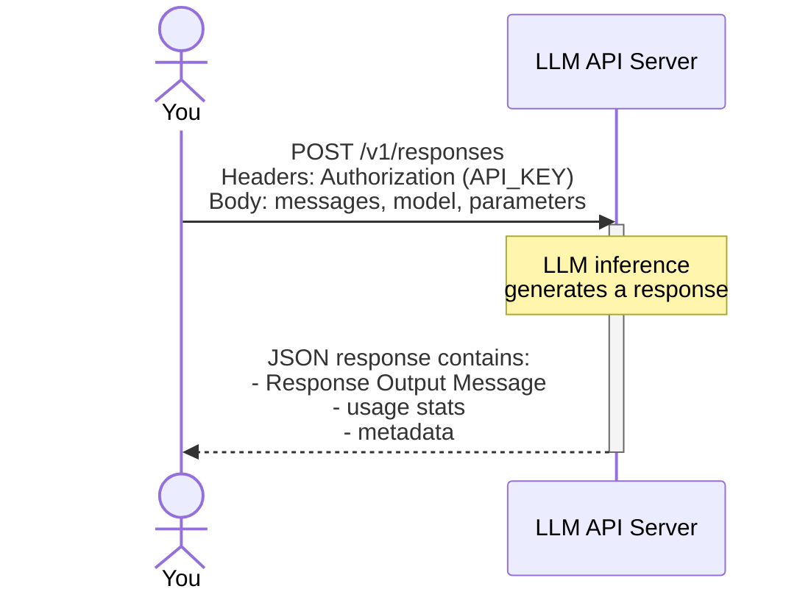
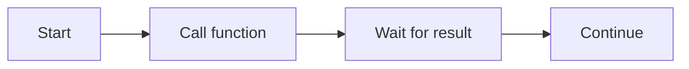
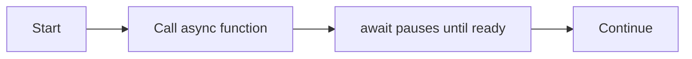

# Harnessing LLMs for research
Foundations of Research Computing (FORC) Camp

_Sajid Ali_, _NYU Research Technology Services_ <a href="https://services.rt.nyu.edu/" class="ns-c-iconlink"><mdi-open-in-new /></a>  

<div class="abs-br m-6 text-xl">
  <a href="https://github.com/NYU-RTS/llm-forc" target="_blank" class="slidev-icon-btn">
    <carbon:logo-github />
  </a>
</div>

<!--
The last comment block of each slide will be treated as slide notes. It will be visible and editable in Presenter Mode along with the slide. [Read more in the docs](https://sli.dev/guide/syntax.html#notes)
-->

---
hideInToc: true
---
  
# Table of contents

<Toc text-sm minDepth="1" maxDepth="1" />

---
layout: side-title
side: l
color: violet
titlewidth: is-4
align: rm-lm
---

:: title ::

# What are LLMs?

# <mdi-arrow-right />

:: content ::

Let's go over some basics of what LLMs are and how they generate text.

---
layout: top-title-two-cols
columns: is-5-7
align: l-lt-lt
color: violet-light
hideInToc: true
---


[^ref1]: <div class="ns-c-cite">Adapted from Hands-On Large Language Models by Jay Alammar & Maarten Grootendorst.</div>

:: title ::

# Neural Networks

:: left ::

- Neural networks are the building blocks of the components that make up an LLM.

- Connected layers of varying shapes

- Inputs "pass" through the network to generate output


:: right ::


Overview of neural networks[^ref1] 


---
layout: top-title-two-cols
columns: is-7-5
align: l-lt-lt
color: violet-light
---

[^ref1]: <div class="ns-c-cite"><a href="https://arxiv.org/abs/1706.03762">Attention Is All You Need</a></div>
[^ref2]: <div class="ns-c-cite">Adapted from Hands-On Large Language Models by Jay Alammar & Maarten Grootendorst.</div>


:: title ::

# LLMs overview

:: left ::

- Within natural language, the meaning of a word depends on the context it occurs in, but older language models did not account for this. 

- Recent advances in model architectures[^ref1] to account for it allowed language models to become better at a wider variety of tasks.

- LLMs are neural networks which have billions of parameters!


:: right ::


Applications of LLMs[^ref2]


---
layout: top-title-two-cols
columns: is-6
align: l-lt-lt
color: violet-light
hideInToc: true
---


[^ref1]: [<div class="ns-c-cite">Tiktokenizer</div>](https://tiktokenizer.vercel.app/?model=gpt-4o)


:: title ::

# From text to tokens

:: left ::

- Tokens are the basic unit of operation for LLMs, these are typically units of language 
smaller than words.

- Each token is internally represented by a token embedding

- Special tokens are used to denote things like start/end of sequence, denote the "role" for a sequence, etc.

:: right ::


Interactive demo of tokenization, head to [this link](https://tiktokenizer.vercel.app/?model=gpt-4o) and try it out![^ref1] 


---
layout: top-title-two-cols
columns: is-8
align: l-lt-lt
color: violet-light
hideInToc: true
---


[^ref1]: <div class="ns-c-cite">Adapted from Hands-On Large Language Models by Jay Alammar & Maarten Grootendorst.</div>

:: title ::

# How do LLMs generate output?

:: left ::

- Input tokens are then passed through the LLM to generate an output token. 
- This output token is appended to the input to generate another token.
- So forth until either a special `eos` (end of sequence) token is generated or the number of tokens exceeds the maximum number of tokens that the LLM was allowed to generate.


:: right ::


LLMs generate output one token at a time[^ref1] 


---
layout: top-title-two-cols
columns: is-5
align: l-lt-lt
color: violet-light
hideInToc: true
---


[^ref1]: <div class="ns-c-cite">Adapted from Hands-On Large Language Models by Jay Alammar & Maarten Grootendorst.</div>

:: title ::

# Token sampling

:: left ::

- Rather than generating a single token, LLMs generate a distribution.
- These tokens are then sampled to select one token.
- You can alter how the LLM performs this sampling by adjusting the `temperature` parameter.


:: right ::


LLMs generate output one token at a time[^ref1]

---
layout: top-title-two-cols
columns: is-6
align: l-lt-lt
color: violet-light
---


[^ref1]: <div class="ns-c-cite">Adapted from <a href="https://newsletter.maartengrootendorst.com/p/a-visual-guide-to-reasoning-llms">A Visual Guide to Reasoning LLMs by Maarten Grootendorst</a>.</div>

:: title ::

# Reasoning LLMs

:: left ::

- Reasoning LLMs emit "reasoning" tokens before final output tokens
- Most reasoning models allow you to set reasoning level and budget
- The visibility of reasoning tokens varies by providers
- Even though the reasoning tokens might not be visible to you, they are still billed for, occupy the context window and count towards the limit of maximum token usage set by you.

:: right ::


Reasoning LLMs have been trained to imitate thought processes[^ref1]


---
layout: top-title-two-cols
columns: is-6
color: violet-light
---


:: title ::

# LLM API servers

:: left ::
- LLMs are programmatically accessible via an HTTP server, typically via the Responses API
- To invoke the LLM, you send an HTTP request with:
    <div class="ns-c-tight">
    - your `API_KEY` <br/>
    - message body, i.e. prompt and any conversation history <br/>
    - model to invoke <br/> 
    - parameters like maximum tokens, temperature, thinking/reasoning level, etc. <br/>
    </div>

:: right ::


```mermaid {scale: 0.75}
sequenceDiagram
    actor U as You
    participant Server as LLM API Server

    U->>Server: POST /v1/responses <br/> Headers: Authorization (API_KEY)<br/>Body: messages, model, parameters
    activate Server
    Note over Server: LLM inference  <br/> generates a response
    Server-->>U: JSON response contains:<br/>- Response Output Message<br/>- usage stats<br/>- metadata
    deactivate Server

```


---
layout: top-title
color: violet-light
hideInToc: true
---

:: title ::

# Anatomy of an LLM API call

:: content ::
<v-switch>
  <template #1> 

Example Query

```bash
curl https://ai-gateway.apps.cloud.rt.nyu.edu/v1/responses \
  -H "x-portkey-api-key: $PORTKEY_API_KEY" \
  -H "Content-Type: application/json" \
  -d '{
     "model":"@vertexai/gemini-3.5-flash", 
     "input": 
      [
        {"role": "system", "content": "You are a helpful assistant." }, 
        { "role": "user", "content": "What resources are available for genAI research at NYU?"}
      ], 
      "max_output_tokens":"1024"
      }'
```
 </template>
  <template #2>

  Response (truncated)

```json 
{"status":"completed", "model":"gemini-3.5-flash",
"output": [{
    "type":"message",
    "role":"assistant",
    "status":"completed",
    "content":
      [{
          "type":"output_text",
          "text":"New York University (NYU) is one of the world’s leading institutions for Artificial Intelligence 
          and Generative AI (GenAI) research. Benefiting from its proximity to major tech hubs and its world",
      }]
}],
"top_p":1, "presence_penalty":0, "frequency_penalty":0, "top_logprobs":0, "temperature":1, "reasoning":null,
"usage": {
    "input_tokens":18,
    "input_tokens_details": {"cached_tokens":0},"output_tokens":1020,
    "output_tokens_details":{"reasoning_tokens":979},"total_tokens":1038},
    "max_output_tokens":"1024"
}}
```

 </template>
</v-switch>


---
layout: top-title-two-cols
columns: is-6
color: violet-light
hideInToc: true
---

:: title ::

# Message Roles

:: left ::

Each message within the conversation thread has a **role** associated with it.

Head back to the tokenizer playgrond and look for the these special tokens:
<div class="ns-c-tight">

- `system` <br/>
- `assistant` <br/>
- `user` <br/>

</div>

:: right ::

<SpeechBubble position="l" color="cyan-light" textAlign="left" shape="round" maxWidth="400px">

**system:** Affects the tone and shapes the behaviour of the assistant messages

</SpeechBubble>
<br/>

<SpeechBubble position="l" color="emerald-light" shape="round" maxWidth="400px">

**user:** Messages sent by you to the LLM

</SpeechBubble>
<br/>

<SpeechBubble position="r" color="violet-light" textAlign="right" shape="round" maxWidth="400px">

**assistant:** Messages by the LLM to you

</SpeechBubble>


---
layout: top-title-two-cols
columns: is-4
color: violet-light
---

:: title ::

# LLM gateway

:: left :: 
- API access to LLMs for research workflows is facilitated by an LLM gateway (Portkey) at NYU.
- Beyond providing a unified interface for all LLMs, it:
    <div class="ns-c-tight">
    - has a UI for prototyping <br/>
    - prompt library to version and template your prompts <br/>
    - allows you to view the logs for each request <br/>
    - lets you perform batch processing <br/>
    </div>
- We will be exploring it in the hands on session now.

:: right ::


---
layout: side-title
side: l
color: violet-light
titlewidth: is-4
align: rm-lm
---

:: title ::

# Hands on

# <mdi-arrow-right />

:: content ::

Head over to app.portkey.ai and choose the "Login with SSO" option with your NetID@nyu.edu email address.


---
layout: top-title-two-cols
columns: is-8
color: violet-light
hideInToc: true
---

:: title ::

# Creating an API Key

:: left :: 


<br/>
User vs Service Keys: logs with user key will have the NetID of the user as part of the metadata while the services will not. 

Stick to user keys unless you're developing a service.

:: right ::


---
layout: top-title-two-cols
columns: is-3
color: violet-light
hideInToc: true
---

:: title ::

# Prompt Playground

:: left :: 
- Explore the effect of parameters
- Run the same prompt across various models
- Create prompt templates with dynamic variables
- Attach files (PDFs/Images/etc) to prompts
- Enable tool calling (we will discuss this in depth soon)

:: right ::
<v-switch>
  <template #1>
    
  </template>
  <template #2>
    
  </template>
</v-switch>

---
layout: top-title-two-cols
columns: is-7
color: violet-light
---

:: title ::

# Observability 

:: left :: 
- Explore all the parameters set for a query
- Access the token usage breakdown between reasoning and output
- View the list of available tools, usage requirement and usage traces
- API to export logs is available

:: right ::
<v-switch>
  <template #1>
    
  </template>
  <template #2>
    
  </template>
  <template #3>
    
  </template>
</v-switch>

---
layout: top-title-two-cols
columns: is-6
color: violet-light
hideInToc: true
---


:: title ::

# Sending a request in Python

:: left ::
- We will use the `portkey-ai` package for this using an API key created from the UI and the following `base_url`: `https://ai-gateway.apps.cloud.rt.nyu.edu/v1/` (or to `https://portkey-lb.rt.nyu.edu/prod/` if you're using JupyterHub today).

<AdmonitionType type="warning" width="325px">

Whenever you instantiate a `Portkey` client, the `base_url` must be set. If you miss this parameter you would be connecting to the vendor's SaaS platform and NYU provisioned virtual keys will not work.

</AdmonitionType>

:: right ::

```python !children:text-xs
import os
from portkey_ai import Portkey


client = Portkey(
    base_url="https://ai-gateway.apps.cloud.rt.nyu.edu/v1/",
    api_key=os.getenv("PORTKEY_API_KEY"),
)

response = client.responses.create(
    model="@vertexai/gemini-3.5-flash",
    input="Complete the following sentence: The sun is shining and the sky is",
)

print(response.output)
```


---
layout: top-title-two-cols
columns: is-6
color: violet-light
hideInToc: true
---

:: title ::

# Inconsistent response formats

:: left ::

For instance, running the prompt below with various LLMs shows us that the response format is not consistent among them.


```python
prompt = prompt = """
Extract data from the following text:

<text>
# Structured Data
By Carson Sievert
</text>
"""
"""
```

:: right ::
  
  <SpeechBubble position="r" color="cyan-light" textAlign="left" shape="round" maxWidth="475px">
  
  **gemini-2.5-flash-lite**
  ```json
  [
    {"data": "Structured Data", "type": "title"},
    {"data": "Carson Sievert", "type": "author"}
  ]
  ```
  </SpeechBubble>
  <SpeechBubble position="r" color="fuchsia-light" textAlign="left" shape="round" maxWidth="475px">
  
  **gemini-3-pro-preview**
  ```
  **Title:** Structured Data
  **Author:** Carson Sievert
  ```
  </SpeechBubble>
  <SpeechBubble position="r" color="yellow-light" textAlign="left" shape="round" maxWidth="475px">
  
  **gpt-5-mini**
  ```
  {
  "title": "Structured Data",
  "author": "Carson Sievert",
  "raw": "# Structured Data\nBy Carson Sievert"
  }
  ```
  </SpeechBubble>

---
layout: top-title-two-cols
columns: is-6
color: violet-light
---
:: title ::

# Structured outputs

:: left ::

You can specify a response format to ease integration of LLM outputs into your workflows.

```python
class ArticleSpec(BaseModel):
    """Information about an article written in markdown"""

    title: str = Field(description="Article title")
    author: str = Field(description="Name of the author")
```
and call the LLM with the response schema passed alongside the prompt:
```python
response = portkey.responses.parse(
    model="@vertexai/gemini-3-flash-preview",
    input=prompt,
    text_format=ArticleSpec
)
print(response.output_parsed)
```

:: right ::
  
  <SpeechBubble position="r" color="cyan-light" textAlign="left" shape="round" maxWidth="400px">
  
  **gemini-2.5-flash-lite**
  ```
  {
    "title": "Structured Data",
    "author": "Carson Sievert"
  }
  ```
  </SpeechBubble>
  <SpeechBubble position="r" color="fuchsia-light" textAlign="left" shape="round" maxWidth="400px">
  
  **gemini-3-pro-preview**
  ```
{
  "title": "Structured Data",
  "author": "Carson Sievert"
}
  ```
  </SpeechBubble>
  <SpeechBubble position="r" color="yellow-light" textAlign="left" shape="round" maxWidth="400px">
  
  **gpt-5-mini**
  ```
  {
    "title":"Structured Data",
    "author":"Carson Sievert"
  }
  ```
  </SpeechBubble>


---
layout: top-title-two-cols
columns: is-4
color: violet-light
hideInToc: true
---
:: title ::

# Structured outputs

:: left ::

This does not prevent LLMs from hallucinating. For instance, you can add a date field to the schema and see what happens.
```python
class ArticleSpec(BaseModel):
    """Information about an article written in markdown"""

    title: str = Field(description="Article title")
    author: str = Field(description="Name of the author")
    date: str = Field(description="Date written in YYYY-MM-DD format.")

prompt = prompt = """
  Extract data from the following text:

  <text>
  # Structured Data
  By Carson Sievert
  </text>
"""
```

The `date` field is missing in the prompt, put some LLMs hallucinate one.

What happens if you set that field to be `Optional`?


:: right ::
  
  <SpeechBubble position="r" color="cyan-light" textAlign="left" shape="round" maxWidth="400px">
  
  **gemini-2.5-flash-lite**
  ```
  {
    "title": "Structured Data",
    "author": "Carson Sievert",
    "date": "2023-10-26"
  }
  ```
  </SpeechBubble>
  <SpeechBubble position="r" color="fuchsia-light" textAlign="left" shape="round" maxWidth="400px">
  
  **gemini-3-pro-preview**
  ```
{
  "title": "Structured Data",
  "author": "Carson Sievert",
  "date": "null"
}
  ```
  </SpeechBubble>
  <SpeechBubble position="r" color="yellow-light" textAlign="left" shape="round" maxWidth="400px">
  
  **gpt-5-mini**
  ```
  {
    "title":"Structured Data",
    "author":"Carson Sievert",
    "date":""
  }
  ```
  </SpeechBubble>

---
layout: top-title-two-cols
columns: is-7
color: violet-light
---

[^ref1]: <div class="ns-c-cite">Adapted from <a href="https://platform.openai.com/docs/guides/function-calling">Function calling, OpenAI</a>.</div>

:: title ::

# Function calling

:: left :: 

- Until this point we send all the data to the LLM within the prompt and expect an answer that is reasonable. 

- However, some queries require additional context that can only be gathered when the LLM is queried.

- We can pass function/tool definitions to an LLM and let it decide if it needs to be called (or require it to be used).

- There are some tools like web search that are offered by LLM providers as "built-in" tools that users do not have to implement. Here is the `google search` tool that can be used with `gemini` models 

```json
    {"type": "function", "name": "google_search"}
```

:: right ::

<div style="text-align: center;">
  
</div>

Tool call schematic [^ref1]


---
layout: top-title
color: violet-light
hideInToc: true
---

:: title ::

# Die Roll tool

:: content ::

<v-switch>
  <template #1>

  Define the tool implementation and its specification

  ```python
  def roll_dice(N: int) -> int:
    """Roll an N sided die"""
    return random.randint(1,N)
    
    tools = [
      {
        "type": "function",
        "name": "roll_dice",
        "description": "Roll the special N sided dice and return the result",
        "parameters": {
            "type": "object",
             "properties": {
                 "num_sides": {
                    "type": "integer",
                     "description": "Number of sides for the die to roll"
                }
              },
              "required": ["num_sides"]
        }
      }
    ]
  ```
  </template>
  
  <template #2>

  Pass a prompt to the LLM with this tool:
  ```python
  response = portkey.responses.create(
    model="@vertexai/gemini-3.5-flash",
    input=messages,
    tools=tools,
    )

  print(response.output_text)
  ```
  </template>

  <template #3>
  View the response which contains a request to execute the tool:

  ```python
  [
    ResponseFunctionToolCall
    (
      arguments='{"num_sides":10}',
      call_id='call_l38M88Up4bBKgxsU9ZshNVcK', 
      name='roll_dice', 
      type='function_call',
      id='fc_1fa5cd13-13c2-4b66-9937-7907c60fc118', 
      namespace=None, 
      status='completed'
    )
  ]
  ```

  </template>

  <template #4>
  Execute the `roll_dice` function locally and send the result back to the LLM:
  
  ```python
  [
    {
      'role': 'user',
      'content': 'Roll a 10 sided die and check if the dice roll was valid. Explain your reasoning.'
    },
    ResponseFunctionToolCall(
      arguments='{"num_sides":10}', 
      call_id='call_l38M88Up4bBKgxsU9ZshNVcK', 
      name='roll_dice', 
      type='function_call', 
      id='fc_1fa5cd13-13c2-4b66-9937-7907c60fc118', 
      namespace=None, 
      status='completed'),
    {
      'type': 'function_call_output',
      'call_id': 'call_l38M88Up4bBKgxsU9ZshNVcK',
      'output': '4'
    }
  ]
  ```

  </template>

  <template #5>

  Final response (truncated) from LLM:
  
  ```python
  Response(
    model='gemini-3.5-flash', object='response',
    output=[
      ResponseOutputMessage(
        content=[
          ResponseOutputText(
          text='The result of the 10-sided die roll is **6**.\n\n**Validity Check:**\n* \
          **Die Type:** 10-sided die ($d10$).\n* **Possible Outcomes:** Any integer from 1 to 10 \
          (inclusive): $\\{1, 2, 3, 4, 5, 6, 7, 8, 9, 10\\}$.\n* **Actual Outcome:** 4.\
          \n\n**Reasoning:**\nSince the roll produced the number 4, which is an integer and \
          falls within the valid range of 1 to 10 for a 10-sided die, the dice roll is **valid**.', 
          type='output_text', logprobs=[])], role='assistant', status='completed', type='message', phase=None)], 
      tool_choice='auto', 
      tools=[FunctionTool(name='roll_dice', 
      parameters={'type': 'object', 'properties': 
          {'num_sides':{'type': 'integer', 'description': 'Number of sides for the die to roll'}}, 
          'required': ['num_sides']}, strict=None, type='function', 
      defer_loading=None, description='Roll the special N sided dice and return the result')],
      usage=ResponseUsage(input_tokens=85, input_tokens_details=InputTokensDetails(cached_tokens=0),
      output_tokens=296, output_tokens_details=OutputTokensDetails(reasoning_tokens=153),
      total_tokens=381)
  )  
  ```

  </template>

</v-switch>


---
layout: top-title
color: violet-light
hideInToc: true
---

:: title ::

# LLM Tool Calling

:: content ::

<v-switch>
  <template #1>

  ```mermaid {scale: 0.75}
  flowchart LR
    U[User] -->|Request with tools| M[LLM]
  ```
  </template>
  
  <template #2> 

  ```mermaid {scale: 0.75}
  flowchart LR
    U[User] -->|Request with tools| M[LLM]
    M -->|Response: tool call| U
  ```
  </template>
  <template #3> 

  ```mermaid {scale: 0.75}
  flowchart LR
    U[User] -->|Request with tools| M[LLM]
    M -->|Response: tool call| U
    U -->|Execute Tool| T[Tool]
  ```
  </template>
  <template #4> 

  ```mermaid {scale: 0.75}
  flowchart LR
    U[User] -->|Request with tools| M[LLM]
    M -->|Response: tool call| U
    U -->|Execute Tool| T[Tool]
  ```

  ```mermaid {scale: 0.75}
  flowchart LR
    U[User] -->|New request with result of Tool call| M[LLM]
  ```
  </template>
  
  <template #5> 

  ```mermaid {scale: 0.75}
  flowchart LR
    U[User] -->|Request with tools| M[LLM]
    M -->|Response: tool call| U
    U -->|Execute Tool| T[Tool]
  ```

  ```mermaid {scale: 0.75}
  flowchart LR
    U[User] -->|New request with result of Tool call| M[LLM]
    M -->|Final answer with no tool calls| U
  ```
  </template>

</v-switch>


---
layout: top-title
color: violet-light
hideInToc: true
---

:: title ::

# Multiple Tool Calls

:: content ::

  One response can request multiple tools: 
  ```mermaid {scale: 0.75}
  flowchart LR
    U[User] -->|Request with tools| M[LLM]
    M -->|Response: tool call 1| U
    U -->|Execute Tool 1| T1[Tool]
    M -->|Response: tool call 2| U
    U -->|Execute Tool 2| T2[Tool]
  ```

  Execute them and send their results back together:

  ```mermaid {scale: 0.75}
  flowchart LR
    U[User] -->|New request with result of Tool calls 1 and 2| M[LLM]
    M -->|Final answer with no tool calls| U
  ```


---
layout: top-title
color: violet-light
---

:: title ::

# Agents

:: content ::

- We've seen how we could handle each tool call ourselves
- Since this is a common pattern that occurs with LLMs in many scenarios, `Agent` frameworks were developed to handle this
- With an agent, the workflow now becomes:

  ```mermaid {scale: 0.8}
  flowchart LR
    U[User] -->|Prompt with tools| A[Agent]
    A[Agent] -->|Request with tools| M[LLM]
    M -->|Response: tool call| A
    A -->|Tool Call and parameters| R[Tool call runner]
    R -->|Tool Call result| A
    R -->|Parameters| T[Tool]
    T -->|Result| R
    A -->|Request with result of tool calls| M
    M -->|Final response with no tool calls| A
    A -->|Final response with no tool calls| U

  ```


---
layout: top-title-two-cols
columns: is-6
align: l-lt-lt
color: violet-light
hideInToc: true
---

:: title ::

# A Gentle Introduction To `async` / `await`

:: left ::

### Synchronous flow

The program waits for the function to finish before moving on:


```mermaid {scale: 0.5}
flowchart LR
  A[Start] --> B[Call function]
  B --> C[Wait for result]
  C --> D[Continue]
```

```python
result = function(parameters)
use(result)
```

Results are available as soon as the function is run.


:: right ::

### Asynchronous flow

An `async` function can do its work while the program handles other tasks:


```mermaid {scale: 0.5}
flowchart LR
  A[Start] --> B[Call async function]
  B --> C[await pauses until ready]
  C --> D[Continue]
```

```python
result = await async_function(parameters)
use(result)
```

Asynchronous functions are scheduled to be run on an `event loop`. The main benefit is that the program can run other tasks while the asynchronous function runs in the background.

For today, we will be using `await` to pause execution until the result is ready. With it, this call behaves synchronously from this point of view.


---
layout: top-title
color: violet-light
---

:: title ::

# Agents, with PydanticAI

:: content ::


<v-switch>
  <template #1>
  We can rewrite our previous, verbose chain of events as:

  ```python
  agent = Agent(
      name="agent-with-custom-tool",
      model=OpenAIResponsesModel(
          model_name="@vertexai/gemini-3.5-flash",
          provider=OpenAIProvider(
              base_url="https://ai-gateway.apps.cloud.rt.nyu.edu/v1/",
              api_key=os.getenv("PORTKEY_API_KEY"),
          ),
      ),
  )

  @agent.tool_plain  
  def roll_dice(N: int) -> int:
    """Roll a N-sided die and return the result."""
    return random.randint(1, N)
  ```
  </template>

  <template #2>
  Execution becomes much simpler as the `agent` handles the tool call for us:

  <br/>
  <br/>

  ```python
  # await is added because the agent is run asynchronously
  result = await agent.run( 
                           'Roll a 10 sided die and check if \
                            the dice roll was valid. \
                            Explain your reasoning.'
                          ) 
  ```
  </template>
</v-switch>


---
layout: top-title
color: violet-light
---

:: title ::

# Model Context Protocol

:: content ::

Model Context Protocol is a standardized interface to provide a set of tools instead of describing them one at a time. The responsibility of tool execution now lies with the MCP server.

<br/>

  ```mermaid {scale: 0.8}
  flowchart LR
    U[User] -->|Prompt with MCP server addresses| A[Agent]
    A[Agent] -->|Request with tool call| M[LLM]
    M -->|Response: tool call| A
    A -->|Tool Call and parameters| C[MCP client]
    C -->|Tool Call result| A
    C -->|Execute Tool| S[MCP Server]
    A -->|Request with result of tool calls| M
    M -->|Final response with no tool calls| A
    A -->|Final response with no tool calls| U
  ```


---
layout: side-title
side: r
color: violet-light
align:  lm-lm
---

:: title ::
# Summary

# <mdi-arrow-left />

Reach out to Research Technology Services, https://services.rt.nyu.edu/

<PoweredBySlidev mt-10 />

:: content ::

We have learnt:
-  What LLMs are.
-  How they generate text.
-  How you can generate structured outputs from LLMs.
-  How NYU facilitates your access to AI resources.
